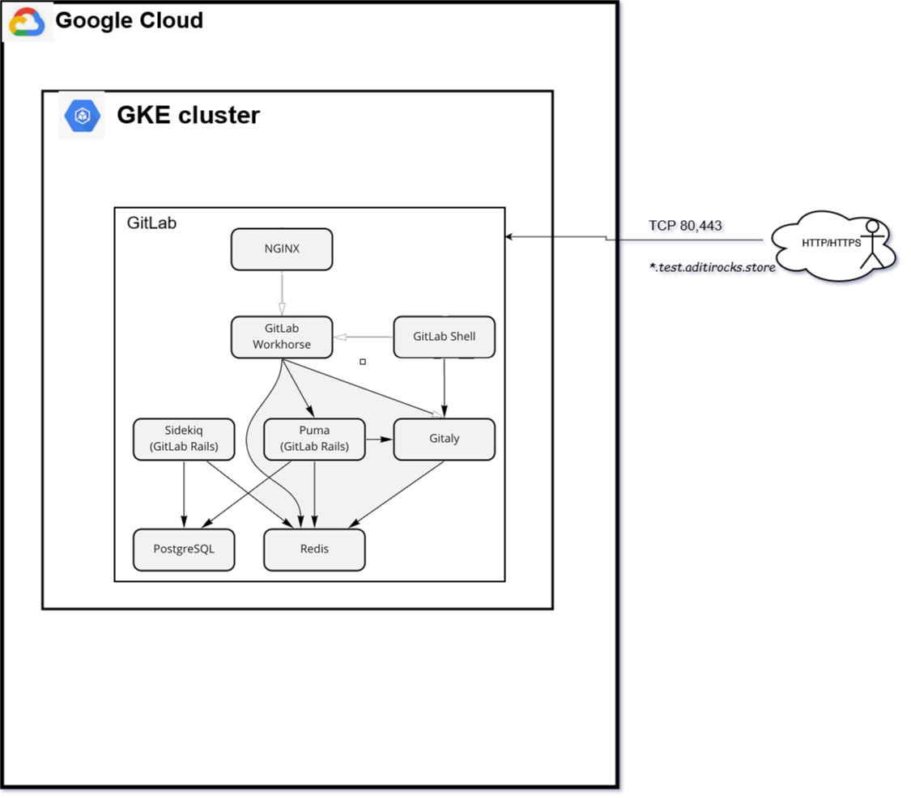
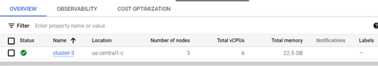
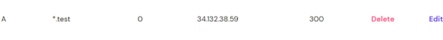

# Deploying GitLab service using Helm charts

<a name="top"></a>
__Contents:__

* [Introduction](#intro)
* [Components Used](#components)
* [Files description in project](#files)
* [Steps done to deploy GitLab service](#steps)
* [Outputs](#output)


<a name="intro"></a>
## Introduction

**GitLab** is an application for software development, security, and operations that enables Concurrent DevOps. GitLab makes the software
lifecycle faster and radically improves the speed of business. It provides solutions for each of the stages of the DevOps lifecycle.

More on GitLab: https://docs.gitlab.com/ee/


<a name="Components"></a>
## Components Used

Following components were used to design this project:

1. **Kubernetes cluster GKE** -- Google cloud instance to create one Kubernetes cluster.

2. **Helm charts** -- To deploy services(GitLab) on Kubernetes cluster.

3. **Domain name** -- Domain name to access GitLab as webUrl.




<a name="files"></a>
## Files description in project

* [Helm chart files](./gitlab_helm_chart) -- used to deploy GitLab helm chart on Kubernetes.


<a name="steps"></a>
## Steps done to deploy GitLab service:

1) Create the Kubernetes cluster (GKE) in Google Cloud.
   
2) Login into Cluster and create a namespace (created 'git' namespace in my case).
3) Generated Public IP address in Google cloud to access from outside.
4) Updated the public IP as A record in DNS record with domain name aditirocks.store, screenshot below.
   
5) Run the helm chart with below command
   ```helm upgrade --install gitlab ./gitlab_helm_chart 
    --timeout 600s 
    --set global.hosts.domain=test.aditirocks.store 
    --set global.hosts.externalIP=34.132.38.59
    --set certmanager-issuer.email=aditi@gitlab.com -n git```

<a name="output"></a>
## Outputs
Outputs captured here [output.docx](./output.docx)
